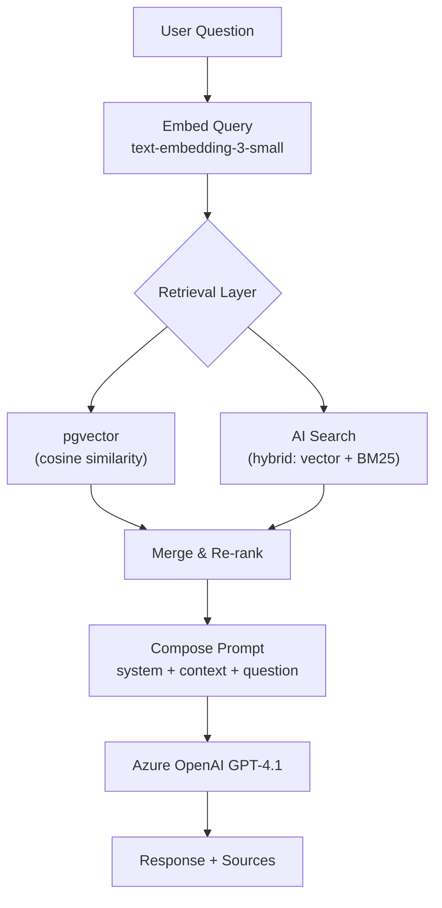
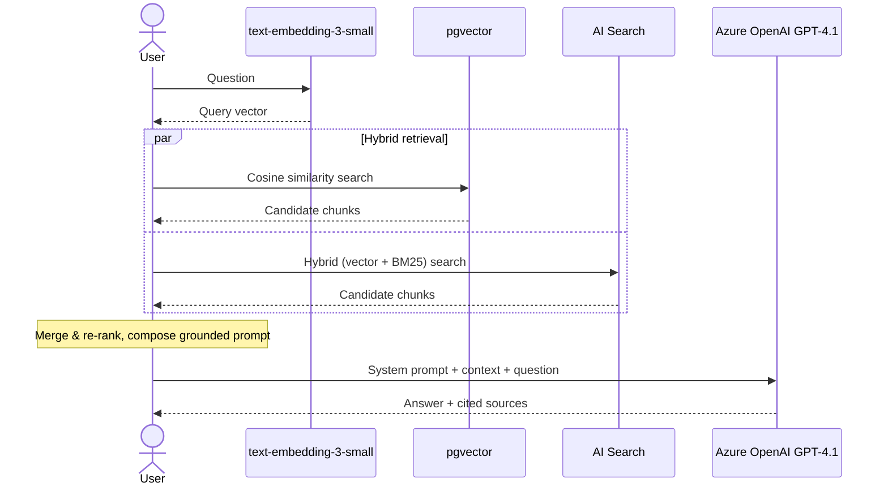

# 🔍 Phase 3: RAG Query Flow

> 📊 **Status:** ████████████████████ 100% Ready | 🏷️ **Version:** 1.0.0 | 📅 **Updated:** 2026-03-09

**⏱ Time Box: ~30 minutes**

## 🎯 Objective

Build and test the retrieval-augmented generation (RAG) pipeline end-to-end. You'll issue a natural language question, retrieve relevant SOP chunks using both vector and hybrid search, compose a prompt with retrieved context, call Azure OpenAI, and review a grounded response with source citations.

---

## ✅ Prerequisites

- 🔹 Phase 2 complete (SOPs indexed in both AI Search and pgvector)
- 🔹 Azure OpenAI `gpt-4.1` deployment ready
- 🔹 Azure OpenAI `text-embedding-3-small` deployment ready

---

## 📋 Step 1: Review RAG Architecture

Before running queries, understand the data flow:





Review the query module:

```bash
ls app/query/
# Expected: __init__.py, retriever.py, composer.py, runner.py, etc.
```

> **🗣️ Facilitator Note:** Draw this diagram on a whiteboard or share it on screen. Ask: "Where does RAG differ from just sending the question directly to GPT-4?" Answer: the retrieval step grounds the model's response in your actual SOPs, reducing hallucination.

---

## 📋 Step 2: Test Vector Search (pgvector)

Run a pure vector similarity search against PostgreSQL:

```bash
python -m app.query.retriever \
  --backend pgvector \
  --query "What is the incident response procedure?" \
  --top-k 5
```

Expected output:

```
Search backend: pgvector (cosine similarity)
Query: "What is the incident response procedure?"
Results (top 5):

  1. [0.92] sop-001_chunk_3 — "Upon detection of a security incident, the first
     responder must immediately notify the SOC..."
     Source: sop-001.md | Category: security

  2. [0.89] sop-001_chunk_4 — "Escalation procedures require that any P1 incident
     be reported to the ISSM within 30 minutes..."
     Source: sop-001.md | Category: security

  3. [0.85] sop-003_chunk_1 — "Incident classification follows the NIST framework..."
     Source: sop-003.md | Category: compliance
  ...
```

Note the cosine similarity scores. A score of 1.0 = identical vectors; scores above 0.8 generally indicate strong relevance.

### ✔️ Verification

Confirm you get results with similarity scores > 0.7 for a relevant query.

---

## 📋 Step 3: Test Hybrid Search (AI Search)

Run a hybrid search (vector + keyword) against Azure AI Search:

```bash
python -m app.query.retriever \
  --backend ai_search \
  --query "What is the incident response procedure?" \
  --top-k 5 \
  --search-mode hybrid
```

Expected output:

```
Search backend: AI Search (hybrid: vector + BM25)
Query: "What is the incident response procedure?"
Results (top 5):

  1. [8.72] sop-001_chunk_3 — "Upon detection of a security incident, the first
     responder must immediately notify the SOC..."
     Source: sop-001.md | Category: security

  2. [8.45] sop-001_chunk_4 — "Escalation procedures require that any P1 incident
     be reported to the ISSM within 30 minutes..."
     Source: sop-001.md | Category: security
  ...
```

Note: AI Search returns **search scores** (not cosine similarity), combining vector and keyword relevance via Reciprocal Rank Fusion (RRF).

### ✔️ Verification

Compare the result ordering to the pgvector results. You should see:
- Mostly the same top results (good — both engines agree)
- Possibly different ordering (expected — hybrid search may surface keyword-matched results that pure vector search misses)

---

## 📋 Step 4: Compose Prompts with Context

Now assemble the RAG prompt. The composer takes retrieved chunks and builds a structured prompt:

```bash
python -m app.query.composer \
  --query "What is the incident response procedure?" \
  --backend ai_search \
  --top-k 3
```

This outputs the full prompt that will be sent to GPT-4.1:

```
=== SYSTEM PROMPT ===
You are an AI assistant for government operations. Answer questions based ONLY
on the provided SOP context. If the context does not contain enough information
to answer, say so explicitly. Always cite the source document.

=== CONTEXT (3 chunks) ===
[Source: sop-001.md, Section: Incident Response]
Upon detection of a security incident, the first responder must immediately
notify the SOC and begin documentation in the incident tracking system...

[Source: sop-001.md, Section: Escalation]
Escalation procedures require that any P1 incident be reported to the ISSM
within 30 minutes...

[Source: sop-003.md, Section: Classification]
Incident classification follows the NIST framework...

=== USER QUESTION ===
What is the incident response procedure?
```

> **🗣️ Facilitator Note:** This is the most important step to understand. The prompt template enforces grounding — the model is instructed to answer *only* from the provided context and cite sources. This is critical for Gov use cases where "the AI made it up" is not acceptable.

---

## 📋 Step 5: Call Azure OpenAI

Execute the full RAG pipeline — retrieve, compose, and generate:

```bash
python -m app.query.runner \
  --query "What is the incident response procedure?" \
  --backend ai_search \
  --top-k 3 \
  --model gpt-4.1
```

### ✔️ Verification

Confirm the response:
1. Answers the question using SOP content
2. Cites specific source documents
3. Does NOT hallucinate procedures not in the SOPs

---

## 📋 Step 6: Review Response with Sources

The runner outputs a structured response:

```json
{
  "question": "What is the incident response procedure?",
  "answer": "According to SOP-001 (Incident Response Procedure), upon detection of a security incident, the first responder must: 1) Immediately notify the SOC, 2) Begin documentation in the incident tracking system, 3) Classify the incident using the NIST framework (per SOP-003). For P1 incidents, the ISSM must be notified within 30 minutes.",
  "sources": [
    {"document": "sop-001.md", "chunk": "sop-001_chunk_3", "relevance": 8.72},
    {"document": "sop-001.md", "chunk": "sop-001_chunk_4", "relevance": 8.45},
    {"document": "sop-003.md", "chunk": "sop-003_chunk_1", "relevance": 7.31}
  ],
  "model": "gpt-4.1",
  "search_backend": "ai_search",
  "search_mode": "hybrid",
  "token_usage": {
    "prompt_tokens": 847,
    "completion_tokens": 123,
    "total_tokens": 970
  }
}
```

Key things to verify:
- 🔹 **Sources are real** — every cited document should exist in your SOP corpus
- 🔹 **Answer is grounded** — every claim should trace back to a source chunk
- 🔹 **Token usage is reasonable** — prompt tokens should reflect your context size

---

## 📋 Step 7: Compare pgvector vs. AI Search Results

Run the same query against both backends and compare:

```bash
# pgvector only
python -m app.query.runner \
  --query "What is the incident response procedure?" \
  --backend pgvector \
  --top-k 3 \
  --model gpt-4.1 \
  --output /tmp/result_pgvector.json

# AI Search hybrid
python -m app.query.runner \
  --query "What is the incident response procedure?" \
  --backend ai_search \
  --top-k 3 \
  --model gpt-4.1 \
  --output /tmp/result_aisearch.json

# Compare
python3 -c "
import json

with open('/tmp/result_pgvector.json') as f:
    pg = json.load(f)
with open('/tmp/result_aisearch.json') as f:
    ai = json.load(f)

print('=== pgvector sources ===')
for s in pg['sources']:
    print(f'  {s[\"document\"]} (chunk: {s[\"chunk\"]})')

print()
print('=== AI Search sources ===')
for s in ai['sources']:
    print(f'  {s[\"document\"]} (chunk: {s[\"chunk\"]})')

print()
pg_chunks = {s['chunk'] for s in pg['sources']}
ai_chunks = {s['chunk'] for s in ai['sources']}
overlap = pg_chunks & ai_chunks
print(f'Overlap: {len(overlap)}/{max(len(pg_chunks), len(ai_chunks))} chunks in common')
"
```

> **🗣️ Facilitator Note:** Walk through the differences. Hybrid search often surfaces results that pure vector search misses — especially when the query contains specific terminology (e.g., "ISSM", "P1") that benefits from keyword matching.

---

## 💡 Architecture Decision: Why Hybrid Search?

Pure vector search finds **semantically similar** content — great for natural language queries like "how do I handle a security incident?"

But it can miss results where the match is **lexical, not semantic**:
- Acronyms: "ISSM", "ATO", "STIG"
- Specific identifiers: "SOP-001", "NIST 800-53"
- Exact phrases: "30-minute escalation window"

Hybrid search (vector + BM25 keyword) combines both:

```
Hybrid Score = RRF(vector_rank, keyword_rank)

RRF(r) = Σ  1 / (k + rank_i)
```

This gives you **better recall** without sacrificing precision. In government contexts where precise terminology matters, hybrid search significantly outperforms pure vector search.

---

## 💡 Architecture Decision: Prompt Engineering for Gov/Compliance

Our system prompt includes specific directives for government context:

```python
SYSTEM_PROMPT = """
You are an AI assistant for government operations. Follow these rules:

1. Answer ONLY based on the provided SOP context.
2. If the context is insufficient, say "I don't have enough information in the
   available SOPs to answer this question."
3. ALWAYS cite the source document (e.g., "According to SOP-001...").
4. Do NOT speculate, infer, or provide information from general knowledge.
5. If a procedure has specific timelines or requirements, state them exactly
   as written in the SOP.
6. Use clear, professional language appropriate for government communications.
"""
```

**Why these constraints matter:**
- **Rule 1–2:** Prevents hallucination. In a Gov context, a made-up procedure could cause compliance violations.
- **Rule 3:** Enables auditability. Stakeholders can verify the AI's answer against the source SOP.
- **Rule 4:** Eliminates "the AI told me to" risk. If it's not in the SOP, the model says so.
- **Rule 5:** Government procedures often have non-negotiable timelines (e.g., "notify within 30 minutes"). Paraphrasing could change the meaning.

---

> **🗣️ Facilitator Note:** Try some edge case queries with the group:
> - A question the SOPs clearly answer → should get a grounded response
> - A question the SOPs don't cover → should get an "insufficient information" response
> - A question with Gov-specific acronyms → hybrid search should handle this better
>
> This is a great time to discuss how prompt engineering prevents misuse in sensitive contexts.

---

## 🎉 Wrap-Up

At this point, you have a working RAG pipeline:

- [x] Query embedding via `text-embedding-3-small`
- [x] Vector search via pgvector
- [x] Hybrid search via Azure AI Search
- [x] Prompt composition with grounding constraints
- [x] Response generation via GPT-4.1 with source citations
- [x] Side-by-side comparison of search backends

**Next:** [Phase 4 — Safety Integration](lab-guide-phase4.md)

---

## 📋 Version History

| Version | Date | Author | Changes |
|---------|------|--------|---------|
| 1.0.0 | 2026-03-09 | Squad (Beacon 🔦) | Initial release — full lab guide |
